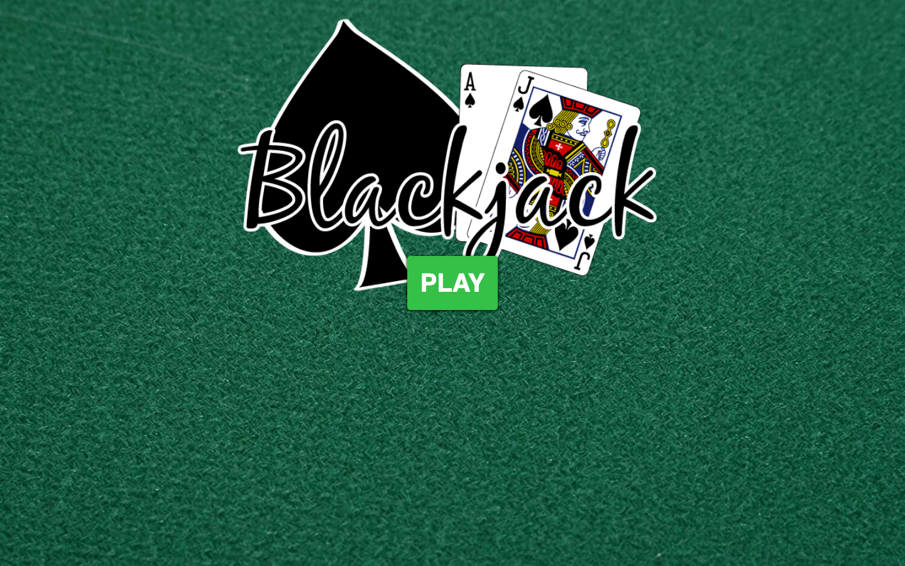
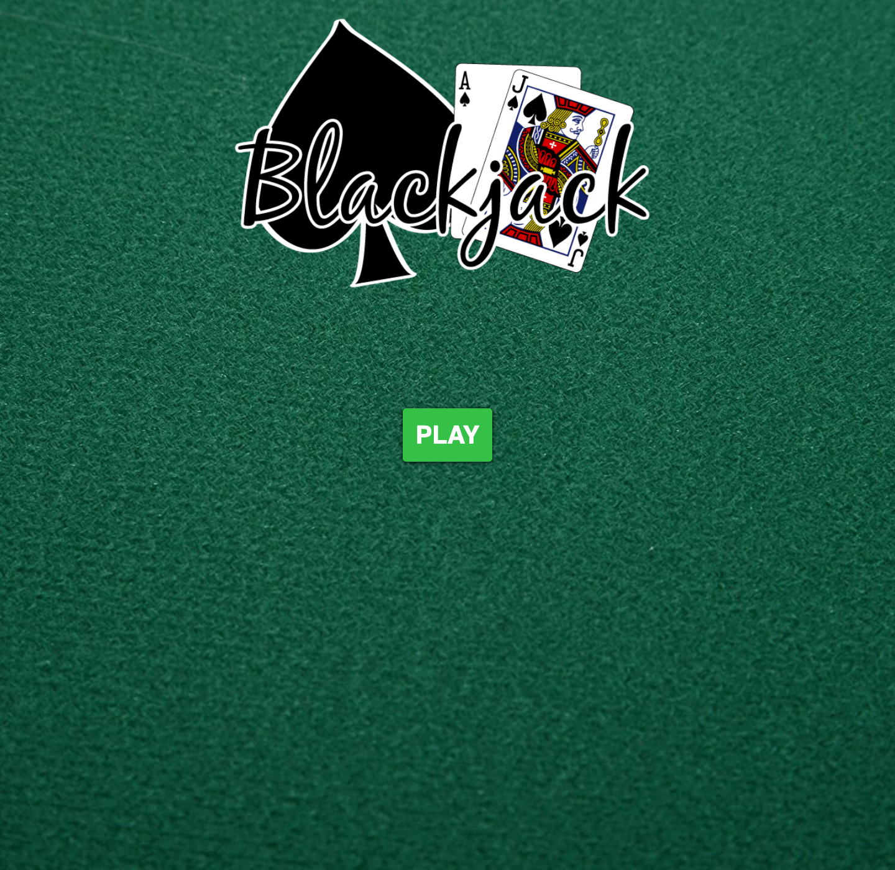
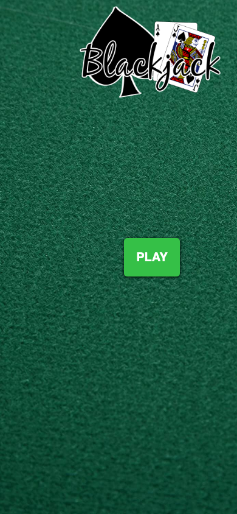

# Blackjack

A browser-based Blackjack game built with React. The project focuses on the core card-game loop and a compact game interface.

**Live site:** [onchetrit.github.io/blackjack](https://onchetrit.github.io/blackjack/)

## Tech

React, Redux, SCSS, and Create React App.

## Screenshots

| Desktop | Game detail | Mobile |
| --- | --- | --- |
|  |  |  |

## Run locally

~~~bash
npm install
npm start
~~~

The development server opens at http://localhost:3000.

## Available scripts

~~~bash
npm start
npm test
npm run build
~~~
